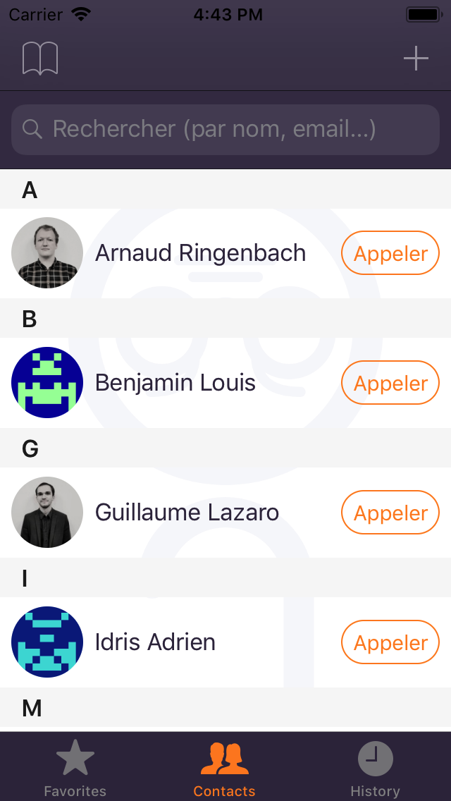
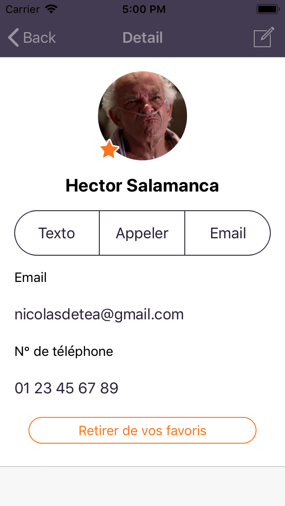

# 

Our final project in Swift 4.

## Screenshots
 &nbsp;
 &nbsp;

## Features
- Manage phone contacts (add, edit, delete)
- Interact in-app (calls, texts, emails)
- Authenticate with a Web Service
- Add favorite contacts
- See most frequent contacts
- Synchronize contacts with a Web Service
- Access contacts offline
- Search within contacts
- Display Gravatars

## Environment / Techs
-  &nbsp;
[Swift Programming Language](https://github.com/apple/swift)

-  &nbsp;
[BuddyBuild](https://www.buddybuild.com/)

## DTA Ingénierie, a unique IT Consulting company in France

#### DTA Ingénierie is working aside big IT companies to help them grow.

This company is aimed at providing young talents specialized in market trending technologies : Android/iOS, Java EE, .NET, Big Data... 200 undergraduate were recruted in 2017.

With more than 100 collaborators all over France, DTA Ingénierie now has a total revenue of 3 million euros in 2016, and expects up to 5 millions in 2017.

## Team
Done in a team of 4 developers :

| *Team Members :* | | |
| :-- | -- | --: |
| Thibault GOUDOUNEIX |  |  |
| Maxime REVEL |  |  |
| Arnaud RINGENBACH |  |  |
| Nicolas VERGOZ |  |  |

| *Instructors :* | | |
| :-- | -- | --: |
| Vincent LEROUX |  |  |
